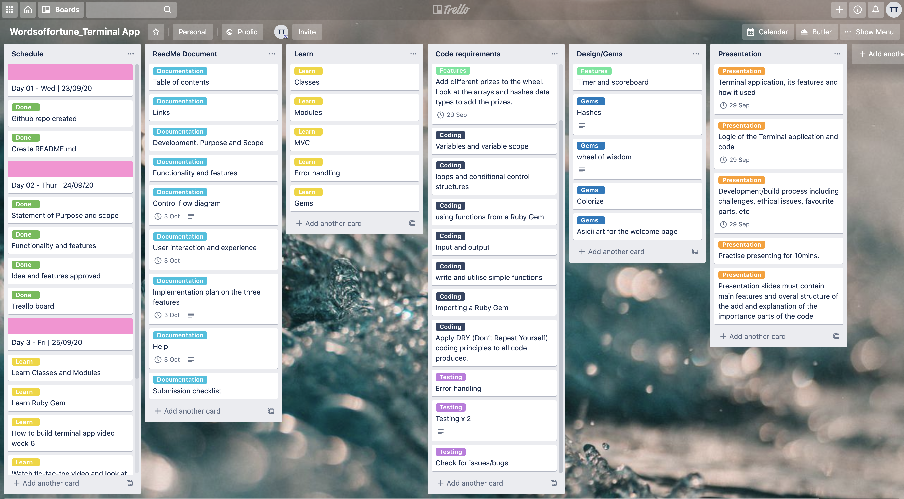

# Software Development Plan - Words of Fortune 

 ## Table of Contents:  
- [Links](#Links)  
- [Development, Purpose & Scope](#Development-purpose-scope)  
- [Functionality and Features](#Functionality-and-Features)  
- [User Interaction and Experience](#User-interaction-and-experience)  
- [Control Flow Development](#Control-flow-development)  
- [Implementation Plan](#Implementation-Plan)  
- [Testing](#Testing)
- [Help Documentation](#help-documentation) 
- [Acknowledgements](#Acknowledgements) 

#

## Links

* [GitHub Repository](https://github.com/Trac3yTran)


#

## Development, Purpose & Scope

Purpose: 

Words of Fortune is a fun educational word-guessing game to be played in a command-line interface. The goal of Words of Fortune is to provide a fun way of learning vocabulary and testing your general knowledge. Player spin the wheel, solve puzzles and train your brain as you go. 

Problem: 

The current problem is more than 20 per cent of Australian adults have very low literacy, numeracy and digital problem-solving skills. Word puzzle game like Words of Fortune helps adult to transform their literacy skills with the engaging, puzzle-solving rounds and improve the processing speed so that they can solve and arrive at the correct answer faster. 

Target Audience:

Words of Fortune is an excellent game for everyone. Created for entertainment purpose, but it can be beneficial, especially in educational space, to boost vocabulary. The importance to spell the words correctly to be able to complete the task in a given time. This is done by allowing the user to guess the secret one letter at a time, which can also help remember the spelling of new words.

Target Audience Usage:

Words of Fortune will be launched from the command line using the files listed in the installation section of this README.md document. 


#

## Functionality and Features

Play classic world game inspired by the TV show. 

- Each round of game contains a category and blank word puzzle with each blank representing a letter in the answer. The player will be able to see the result of each letter input they have entered into the CLI. If they enter an incorrect guess, it will deduct from the seven lives that were set in the game, and it will display "Sorry... you have seven lives left. Try again!". If they correctly guess the letter if will also display a message, You are correct! And if they successfully finish the game, it will indicate "Congratulations... you have won this round!" There is an option to start the game again or exit. User can also exit the game from anywhere in the application and during the game. 

Spinning wheel

-   The spinning wheel automatically start each game to generate a random prize money from the array of prizes ranging from $5, $10, $20, $30, $40, $50, $60, $70, $80, $90, $100, and $200. Once it returns the prize money, it will display the amount the player will be playing for that round. If the player gets all the words correctly within the seven turns, they will be able to get the prize money and added to the leaderboard. 
 
Music

- Music has been to the application as background music. This is used to set the tone for the whole game and establish the style of the story being told. Music also helps the player to understand the functionality and features of the game and to engage more with the functionality of the game. 

#

## User interaction and experience

### How the user will find out how to interact with / use each feature

### How the user will interact with / use each feature

### how errors will be handled by the application and displayed to the user


## Control Flow Development


#

## Implementation plan

I created a Trello board once my idea has been approved to assist with breaking down the three main components from the assignment requirements:  documentation, coding and presentation. My Trello board consist of the schedule for the next 11 days of tasks that I have allocated in different areas to help manage workload in bite-size. After the initial planning was completed on Trello, I had a clear picture of what my application looks like and primarily made possible by using the Trello and the flow chart above. By allocating each task into my schedule and marking it done did allow me to focus on the main goal and keep me on track of completing this before the deadline. 

### [Trello Board](https://trello.com/b/HXjd9mhc/wordsoffortuneterminal-app)




#

## Testing 

Two tests were completed successfully to test for the correct outputs of words and clues and the other test if the strings were returning the correct letter from the word 'sister'.


#
## Help documentation

## Install the application

- If you do not have Ruby on your computer, follow these instructions to [download and install](https://www.ruby-lang.org/en/documentation/installation/)

- Clone the project files onto your computer from the source code here: https://github.com/Trac3yTran/WordsofFortune_RubyApp

- On the terminal command line, navigate to the WordsofFortune directory you have just cloned.
- If you do not have the 'bundler' gem installed on your computer, please enter the following code.
 
```ruby
$ install bundler
```
- In the terminal type in the below folders 

```ruby
cd src/controller
```
- To activate the game enter the below. Make sure your volume is turned on for more personalised experience. 


```ruby
ruby wordsoffortune.rb
```

## Dependencies 

Words of fortune utilies the following gme that are  Mac dependent and will not function on other operating systems.

The following Ruby Gems are required and are included in the Gemfile.

- gem "colorized", "~> 0.0.0"

- gem "tty-prompt", "~> 0.22.0"

- gem 'tty-spinner'

- gem 'terminal-table'

- gem "ruby2d", "~> 0.9.4"

#

# Acknowledgements

ASCII text was generated here

### [fsymbols](https://fsymbols.com/generators/carty/)

